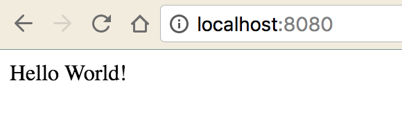

Flatiron School, where I attended for Web Development, was great. As a student, you always had a new lab or a README to click finish and watch the donut turn green (you Flatiron students know what I’m talking about). However, as a programmer being released into the wild, you realize even more how big the jungle of untapped knowledge is (hint: it’s bigger than you think).

Angular 2, React, Node, the list doesn’t end. For each framework or library, you find people who love it & even more who absolutely hate it. It’s hard to pick what direction to go. The bottom line is, put your blinders on, pick one, and master it.

After three Angular projects where I setup with a Rails backend and scrolling through hundreds of files I didn’t need (especially if you aren’t using a database), you know there’s a better way. Enter Node.js. Node is basically Rack if you’re coming from Ruby on Rails, but it’s all Javascript. It’s awesome. If you’d like to fork and clone this project to follow along, go [here](https://github.com/fiveinfinity/node-blog-part-1).

Step one (in your terminal, folks):

```
mkdir node-blog-part-1
```

We’re just building files here so we can understand what’s going on. If you’re coming from Rails, you’re familiar with generators, but let’s just keep it simple for now.

```
touch index.html
```

Create your index page here (still in Terminal), and fill it with this:

```
<!-- index.html -->

<!DOCTYPE html>
 <html>
   <head>
     <title>Node Blog -- Part 1</title>
   </head>
   <body>Hello World!</body>
</html>
```

Something simple for now, and you’re ready to go when it’s time to add your code. If you don’t have Node installed, you’ll [need it](https://nodejs.org/en/download/). Node installation includes the npm package manager, which, in comparison to the Ruby universe, is equivalent to Ruby Gems. The below code starts a Node utility to build your project. You’re going to get some questions from this utility, and to step through these, see comments below for explanations. If you want to skip the utility, add the ‘-y’ flag, like so: ‘npm init -y’.

```
npm init
```

Below is the extent of the utility:

```
name: (test) //project name!
version: (1.0.0) 
description: test node app 
entry point: (index.js) //where your app lives
test command: //your script command to run tests
git repository: github.com/test-repo //github repo URI
keywords:
author: jlachance
license: (ISC) MIT
About to write to /Users/Joe/Desktop/test/package.json:

{
  “name”: “test”,
  “version”: “1.0.0”,
  “description”: “test node app”,
  “main”: “index.js”,
  “scripts”: {
   “test”: “echo \”Error: no test specified\” && exit 1"
  },
  “repository”: {
   “type”: “git”,
    “url”: “git+https://github.com/github.com/test-repo.git"
   },
  “author”: “jlachance”,
  “license”: “MIT”,
  “bugs”: {
   “url”: “https://github.com/github.com/test-repo/issues"
  },
  “homepage”: “https://github.com/github.com/test-repo#readme"
}

Is this ok? (yes)
```

This is going to generate your package.json file, which allows you to install all your dependencies, which you may want to add after running ‘npm init’. For the scope of part 1 of this blog, let’s skip this for now. We need to get a basic page up and running first!

---

### Node Servers

This next section will step you through how to build a server in node. There are a lot of ways to do this, and this stack overflow is a good resource for folks wanting to try some different solutions:

[**Using node.js as a simple web server**  
_I want to run a very simple HTTP server. Every GET request to example.com should get index.html served to it but as a…_stackoverflow.com](http://stackoverflow.com/questions/6084360/using-node-js-as-a-simple-web-server "http://stackoverflow.com/questions/6084360/using-node-js-as-a-simple-web-server")[](http://stackoverflow.com/questions/6084360/using-node-js-as-a-simple-web-server)

I personally like the simplicity of the code using Express for our Node server, so let’s get to it. Enter:

```
npm install express --save
```

the ‘ — save’ flag adds ‘express’ to your package.json dependencies so it will be included with your project files. By running this, you’ll notice you’re also creating a ‘node\_modules’ folder, which is where Node stores all of your modules, like ‘express’. We’ll come back to these in the next part of this blog.

Let’s create a file in your ‘node-blog-part-1’ directory called ‘server.js’:

```
touch server.js
```

Add this code to the ‘server.js’ file (note: this code may copy funky. Double check with syntax highlighting):

```
var express = require(‘express’);
var app = express(); 
app.use(express.static(__dirname)); 
app.listen(8080); 
console.log(‘Server started at localhost:8080');
```

Let’s discuss the above code:

Line 1: we’re requiring the express module.

Line 2: we’re starting a new Express application.

Line 3: This is creating the server on our express application. Without going too deep into the weeds, we’re statically serving all of our files under our base directory.

Line 4: We’re telling our Express server to listen to port 8080.

Line 5: We don’t _need_ this, but it’s really nice to know that this is running, so we log the above to the terminal.

Note: This is all part of what is called _Middleware_. Middleware are requests that are run between the _client request_ and the _servers’ answer_ to those requests. Think of this as the Peanut Butter & Jelly between the bread slices of our Node Server and our front end.

run (in your terminal):

```
node server.js
```

and you should see this if you navigate to [http://localhost:8080:](http://localhost:8080:)



You’ve got Node running! Let’s talk about Webpack and Angular in the following blogs.
