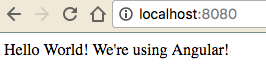

If you’re just finding this post, please see the previous posts getting up and running with Node: [Part 1](https://medium.com/@joelachance/get-started-with-node-js-part-1-19a13d3d731e#.kkgxghca4), [Part 2](https://medium.com/@joelachance/getting-started-with-node-js-part-deux-4e1c4d53eb98#.hoo052593).

Fork and clone the [repo from part 2](https://github.com/fiveinfinity/node-blog-part-2) to follow along, or the finished repo [here](https://github.com/fiveinfinity/node-blog-part-3).

Let’s start with Webpack: Webpack is a module bundler that supports code splitting. In short, this allows you to only use code your application needs. You explicitly tell Webpack what’s necessary via requiring modules in your code (require(‘angular’), for instance). This blog post explains Webpack very well: [http://blog.andrewray.me/webpack-when-to-use-and-why/](http://blog.andrewray.me/webpack-when-to-use-and-why/)

Seriously, quit reading this for 2 seconds and go click that link and read. Then come right back.

Let’s get started! In terminal:

```
npm install angular webpack --save
```

This will add these libraries to your package.json as well as install and save them into your node\_modules folder. In your package.json scripts, you’ll also want to include this:

```
“bundle”: “webpack”
```

We’ll come back to this shortly, but this is how you actually bundle your code using Webpack. Now in your project directory, create a file called ‘webpack.config.js’ & a folder called ‘bundles’, and add the following code:

```
//webpack.config.js

var webpack = require(‘webpack’);

module.exports = {
 context: __dirname + ‘/js’,
 entry: {
  app: ‘./app.js’,
  vendor: [‘angular’]
 },
 output: {
  path: __dirname + ‘/bundles’,
  filename: ‘app.bundle.js’
 },
 plugins: [
  new webpack.optimize.CommonsChunkPlugin(“vendor”,     “vendor.bundle.js”)
 ]
};
```

The above code is what’s being called when you run Webpack. Inside of your module.exports:

Context: This is pointing to the location of the code you’d like bundled. We’re saying: inside of our ‘js’ folder, bundle our app.js file, and include Angular.

Output: This is where our bundled code files will be generated when we run Webpack. We’re telling Webpack to call the file ‘app.bundle.js’, and to put it inside of a folder called ‘bundles’ in our project directory.

Plugins: This is where we tell Webpack how we want to bundle Angular. We’re saying: any libraries above with a key of vendor, bundle as ‘vendor.bundle.js’.

Now is a great time to delete some items in your index.html that you no longer need:

```
<script src=”https://ajax.googleapis.com/ajax/libs/angularjs/1.5.6/angular.min.js"></script>
 <script src=”js/app.js”></script>
 <script src=”js/controllers/HomeController.js”></script>
```

And replace with:

```
<script src=”bundles/vendor.bundle.js”></script>
 <script src=”bundles/app.bundle.js”></script>
```

This is telling our site that it needs to load the bundled files in order to run properly. Since html parses from top to bottom, you need to have your vendor bundle above your app bundle since it’s the file containing Angular (and app.bundle.js needs Angular to run!).

Alright, we’re almost there — a couple more small tweaks. Let’s head over to our Angular controllers:

```
var angular = require(‘angular’);

function HomeController() {
 this.welcome = “Hello World! We’re using Angular!”;
}

angular.module(‘app’).controller(‘HomeController’, HomeController);
```

You’ll notice this is almost identical to our controller in Part 2 of this blog. The single line we’ve changed is line 1, which is telling Webpack that we need Angular in this file so it can find the appropriate Angular code post-bundle. Now to our app.js:

```
angular.module(‘app’, []);

require(‘./controllers/HomeController’);
```

Same here — the last line is the only line that’s changed. By requiring our controller here, our module can now see our controller. If you have any services, components, directives… require them here as well.

That’s all the coding you need to do — Webpack is now integrated with your Node + Angular app! In terminal:

```
npm run bundle
```

Remember the ‘bundle’ script we added to our package.json earlier? The above command is what runs Webpack. You should see something like this in your terminal:

```
// ♥ npm run bundle

> node-blog-part-2@1.0.0 bundle /Users/Joe/Documents/dev/node-blog-part-3
> webpack

Hash: 3c94e91c513518a64f00
Version: webpack 1.13.2
Time: 758ms

Asset Size Chunks Chunk Names

app.bundle.js 422 bytes 0 [emitted] app
vendor.bundle.js 1.22 MB 1 [emitted] vendor

[0] ./app.js 69 bytes {0} [built]
[0] multi vendor 28 bytes {1} [built]
[1] ./controllers/HomeController.js 188 bytes {0} [built]
+ 2 hidden modules
```

This is good output — Webpack has successfully bundled your source code and the Angular framework! In your terminal:

```
node server.js
```

and navigate to [http://localhost:8080](http://localhost:8080) and you should see:



In short, this is a vital part of your toolkit if you’re an Angular user. Webpack is a great tool, however, it’s not without its shortcomings. The Webpack team is growing, but still very small. The documentation is poor. However, if you’re developing a large single page app, Webpack can be very beneficial to keep things running quickly and smoothly.

---

Bonus Level: Webpack has a dev server that I didn’t use here to keep this series flowing without backtracking, however, it’s pretty awesome, and it’s easily integrated replacing the server we wrote. Check it out:

[**webpack dev server**  
_The webpack-dev-server is a little node.js Express server, which uses the webpack-dev-middleware to serve a webpack…_webpack.github.io](https://webpack.github.io/docs/webpack-dev-server.html "https://webpack.github.io/docs/webpack-dev-server.html")[](https://webpack.github.io/docs/webpack-dev-server.html)
