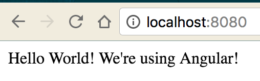

If you haven’t checked out part one, [head there first](https://medium.com/@joelachance/get-started-with-node-js-part-1-19a13d3d731e#.lu0ok882x). Let’s add Angular! I’ll discuss Webpack and other ways to include Angular in the next post, but I want to discuss the bare bones setup so it’s clear how Angular works with Node.js.

Fork and clone [our project](https://github.com/fiveinfinity/node-blog-part-1) from Part 1 to follow along. If you want the completed code for this blog (Part Deux), check it out [here](https://github.com/fiveinfinity/node-blog-part-2).

Inside our ‘index.html’ file, add the following the inside the <head> tags:

```
<script src="https://ajax.googleapis.com/ajax/libs/angularjs/1.5.6/angular.min.js"></script>
<script src="js/app.js"></script>
<script src="js/controllers/HomeController.js"></script>
```

This connects to a CDN (Content Delivery Network) to grab everything that makes Angular work inside of your app. The last two <script> tags are telling your app to include the files where your Angular application lives (we will make these files in the coming the next steps). We’re only going to make a module and a controller to illustrate setting up a very simple Angular + Node app, but as you might guess, this gets to be a very long list of <script> tags if you have an actual Angular app. We’ll address this issue in Part 3.

create the following files, from your base directory (notice these file paths are the same as our ‘src’ in our <script> tags):

```
js/app.js
js/controllers/HomeController.js
```

Inside of your js/app.js:

```
angular.module(‘app’, []);
```

Inside of your js/controllers/HomeController.js:

```
function HomeController() {
    this.welcome = "Hello World! We're using Angular!";
}

angular.module('app').controller('HomeController', HomeController);
```

I’m not going to get into what this Angular code does as it’s outside of the scope of this blog, but know it’s just a simple Hello World app. Lastly, we need to tell our index.html that we’re using Angular so it knows how to render our code. Add the following inside of your <body> tags:

```
<body ng-app=”app” ng-controller=”HomeController as ctrl”>
 <div>{{ctrl.welcome}}</div>
 </body>
```

That’s it! You should have a server setup from the previous blog post, so when you run:

```
node server.js
```

You’ll see:



Next step: adding Webpack to the mix.
