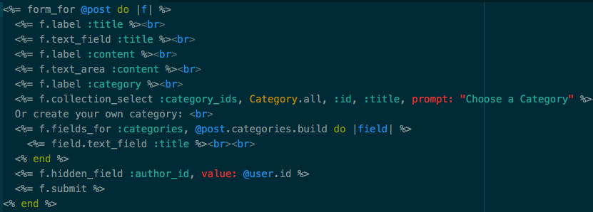
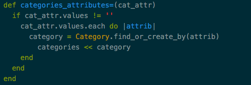
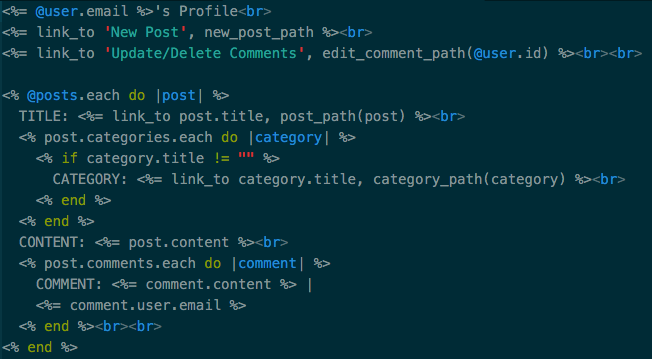
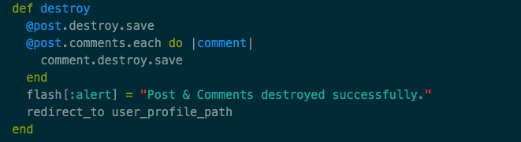
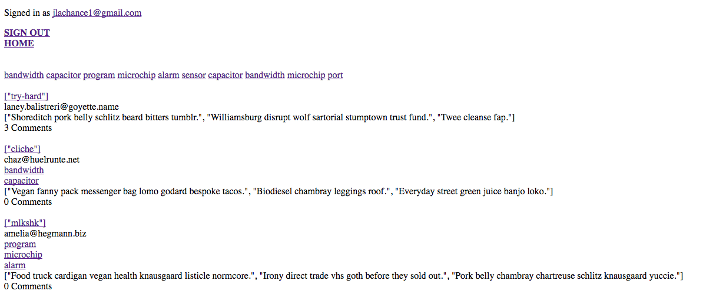

```
rails g scaffold...
```

No, no, no…as nice as it sounds to have a complete rails site in all of its glorious RESTfulness at your fingertips in seconds, you’re not supposed to. Taboo, perhaps? Or does it just generate more files than you’d ever care to even attempt to understand? Only DHH knows (hint: it’s the last one.). We’ve all probably ran ‘rails g scaffold rails-test-site’ just to say, ‘damn, that’s pretty cool’, but to fully understand what the magical Rails does, especially for a beginner, let’s take a step back to….

```
rails new flatiron-reddit
```

This command creates your run o’ the mill barebones Rails frame for you to start hacking away at. Where are the migrations, you say?? Here, lets add some:

```
rails g migration create_posts
```

Or, wait. Let’s do this instead. You not only get your migration, but you get a model along with it! Totally free!

```
rails g model Post title content user_id:integer
```

Title, Content, and User\_id behind your boilerplate code _rails g model MODELNAME_ are your migration columns. Since I didn’t define any of them, they default to the string datatype, except for user\_id. But you knew that already.

Now, lets stop for a minute. I’m pretty lazy, and I don’t want to build out authentication for my very novel & original Flatiron Reddit site. It’s time consuming, and frankly, I like Devise quite a bit. Devise is a Ruby gem that upon running

```
rails g devise:install
```

You get a _devise.rb_ file inside your _config/initializers_ that sets the framework to generate

```
rails g devise User
```

Now, wait. What the hell is that? Well, since you asked, its the same as your old favorite, _rails g model User_, but, with Devise. I know. Fancy. Yet, still, what is this ‘Devise’? And, why do I even care? When you run the above code, Devise generates all the necessary views, controllers, and adds several macros to your new _User_ model that it also just generated. Throw a _rails s_ into your terminal, and watch your login work seamlessly. You did that! Congrats! (If you’re feeling like doing some exploring, type in _rake routes_ or visit your _config/routes.rb_ and see all of the rails/devise magic that single line created for you!)

A forewarning: Devise is some powerful shit. When I first attempted to use Devise, I got very stuck. Mainly, because of all of these fancy macros:

```
devise :database_authenticatable, :registerable, :recoverable, :rememberable, :trackable, :validatable, :confirmable, :lockable, :timeoutable, :omniauthable
```

There’s probably a hundred more hidden somewhere that I don’t want to know about right now, but all you need to know is that each of these is generating some helper methods for you to use, such as _current\_user_, and _user\_signed\_in?_ See more here:

[**plataformatec/devise**  
_devise - Flexible authentication solution for Rails with Warden._github.com](https://github.com/plataformatec/devise#controller-filters-and-helpers "https://github.com/plataformatec/devise#controller-filters-and-helpers")[](https://github.com/plataformatec/devise#controller-filters-and-helpers)

ANYway, we’ve got some models, migrations, and some devise controllers. Sweet. Once you have your migrations looking sleek and sexy, run _rake db:migrate_ and add those associations to your model!

For this project, I wanted to try and re-create in all of its glory, Reddit. I left some obvious things out for right now, including some CSS. Ok, a lot of CSS. And upvotes. Since I’m the only one using this site since it’s currently hosted at localhost:3000, I didn’t feel right giving myself upvotes. It’s a little too narcissistic for someone just getting the handle on Ruby, even though my Flatiron Reddit posts are pretty great.

I did, however, implement a comments section for posts, as well as categories for posts, which is what I want to discuss in brief.

Categories. This was a slight hitch for me, although in retrospect it shouldn’t have been. I wanted to create a nested attribute for categories through posts, so when you create a new post, you can choose from the previous categories or create your own. Easy peasy.



Wonderful, right? Well, what if you select a category and don’t create a new one? You’ve got an empty string you need to deal with so it doesn’t append your categories list now.



Here we’re finding or creating a Category with your ‘Create a new Category!’ string entry. If there’s text in there, it finds it in Category.all, or creates a brand new one.

When you push your found category to self.categories, its recording the id, and when you ask your database, ‘Hey, what are the categories for post 27?’ it grabs all of those kick-ass category id’s you hand plucked and prints ’em. Where? Right here:



So, comments. You can create one for anyone’s post, but, you have to delete them when you destroy your post. I’ll break the fourth wall for a moment: if you call _destroy.save_ on your post, your post instance is destroyed, but you still have your comment wanting to print on your root under that no longer existing post\_id. So,



Flatiron Reddit in all of its html glory:



Thanks for reading-
