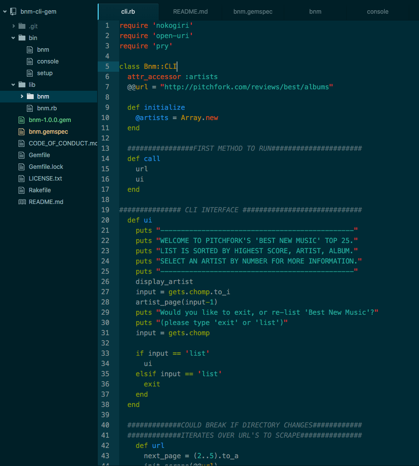
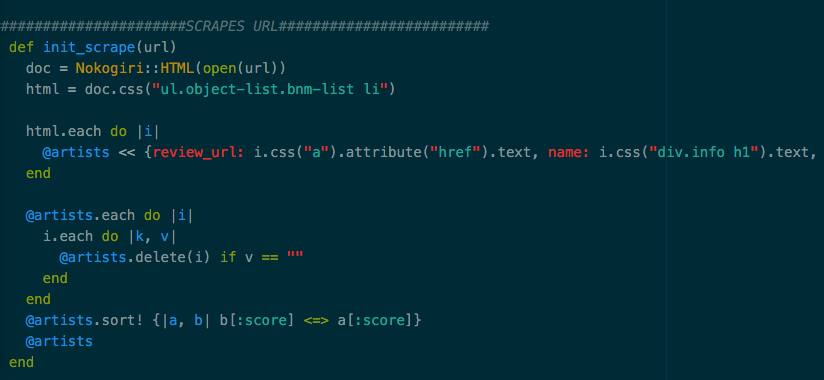

For Flatiron’s Learn-Verified program, students are tasked with building a Ruby CLI Gem from scratch, and I decided on buildilng a scraper using Nokogiri to scrape the Pitchfork website for ‘Best New Music’.

To start, I searched the web for any sites with posts on how to build a Ruby Gem. I watched Flatiron’s post and read several others, and was able to piece together enough to build one. At this point I was starting to realize how much is actually going on in all of the files inside of a Ruby project — a single file that isn’t required correctly can easily break your program.

Each step, I started to test my directory tree with _puts_ statements, making sure everything was starting to work properly. Once everything seemed to be working, I made a list of what I wanted my scraper to do:

1.  Welcome each user and explain the Ruby Gem
2.  Display the artists & their albums, sorted by score
3.  Once an artist is selected, display the review
4.  Prompt user to re-list artists or exit.

During this process, I started to realize how much more there was to be done for a fully functional Gem — website links, other reviews, color coding output, not to mention a program that was more robust to keep it from breaking (if you don’t follow the prompts, this gem does nothing :/ … we’re still in beta everyone!). This will inevitably come later — this was one of the first projects I’ve had that I was really excited to write and complete, mostly because it was _mine_. This was the first lab where my own idea was the focus, which is pretty cool.

At this point, I started to wireframe methods to start creating functionality. With Google Chrome’s Developer Tools, anyone can look at the HTML & CSS for any website — which you need in order to scrape with Nokogiri correctly. With a bare bones method, pry, and Chrome, it’s pretty easy to click around a website and find which CSS selectors you need in order to scrape data. This was by far the most fun part of this project. I’ve gotten the impression a lot of programmers don’t like scraping, but I actually think it’s kind of fun, and Nokogiri makes it almost _too_ easy.

The above method did just that — the html variable scraped a portion of the Pitchfork site, and iterating over that object you can scrape more specific items, such as text and hrefs. Pitchfork’s posts aren’t all identical, so you have to account for some blanks, which is what the each iterator is doing below — anything with blank names, albums, etc., gets deleted from the artists array. Finally, the array is sorted based on the album score from Pitchfork.

Oh, to preface the scraping method, each page on Pitchfork has 5 artists, which isn’t quite enough to pool from — the below method iterated over Pitchfork’s url to add subsequent data in order to scrape the first 5 pages.

I was able to push this gem to RubyGems.org, but I still haven’t been able to get the .exe to work properly, which I’m still currently working on.

It’s been enlightening to work through Ruby the past 6 weeks — as I’m finishing this section of the LV program, I’m just starting to realize how little I know and how much I still have to learn. Overall, this project was a blast to work on, and looking forward to adding to it in the future.

[**bnm | RubyGems.org | your community gem host**  
_RubyGems.org is the Ruby community's gem hosting service. Instantly publish your gems and install them. Use the API to…_rubygems.org](https://rubygems.org/gems/bnm "https://rubygems.org/gems/bnm")

[**fiveinfinity/bnm-cli-gem**  
_bnm-cli-gem - Pitchfork's 'Best New Music' CLI Gem_github.com](https://github.com/fiveinfinity/bnm-cli-gem.git "https://github.com/fiveinfinity/bnm-cli-gem.git")
