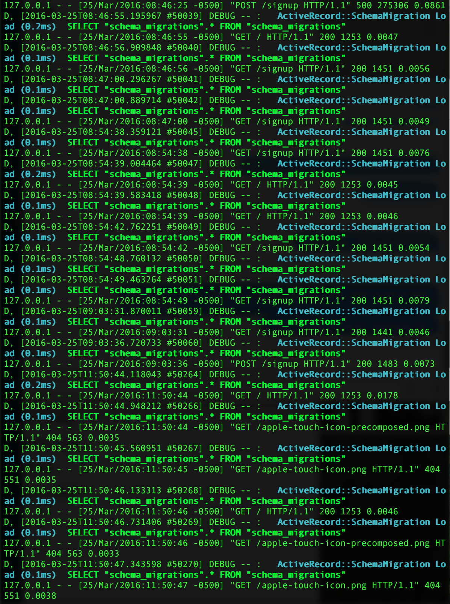

Or both? In honor of Ol’ Blue Eyes and the subject of my CRUD app (it’s a Recipe Book!), here’s his favorite burger recipe:

1.  Call for Deano.
2.  Tell him to make you a f\*\*kin’ burger.
3.  Drink his bourbon.

---

It’s been a month since my last post on my CLI gem, and while programming has certainly gotten more difficult, Sinatra has been a welcome entrance into building web applications, and the impending Ruby on Rails section in LV. Since CRUD (Create, Read, Update, Delete) was introduced in the Sinatra section, it’s taken me until the assessment to really understand a technique that is really simple and formulaic. I can (almost) do it in my sleep by now, but add in ActiveRecord, file trees that have gotten more complicated, and things start to become fragile, especially for someone that’s just been introduced to these methods.

One thing I’ve become to realize from debugging a Ruby CLI to debugging a web application is how many more moving parts there are and knowing what parts can break in what ways. I had some issues editing my AR databases at the beginning of this project, and most of the fixes I was successful at were deleting files and re-migrating tables, which is at best a hack for something I haven’t been able to completely understand yet, which is, I’m assuming at this point, a more elegant way to rollback and dump tables and schema.

I decided on a Recipe Book because I’ve been cooking almost every night at home — my wife and I have decided to eat out twice a month at the most, so searching for recipes and learning some cooking techniques has been a daily occurrence, so naturally a Recipe Book app seemed like a good idea. I’d like to make this site look a little more glamorous, but until I find more time, we’ll keep this very plain looking functional model.

Right now, a user is able to Sign up or Log in if you’ve signed up previously, view all of your recipes along with all other user recipes, edit, delete, and create new recipes. The program throws errors for invalid sign ups and edits, and doesn’t allow you to edit others’ recipes. Writing this interface made me realize how complicated such a small CRUD app can become — I’m not currently using email validation, There’s no editing tools while creating a recipe, there’s no links outside of the site, and there’s a lot of profile data that you would normally see on an actual CRUD app that isn’t included in mine — yet. And, while bootstrap sits at the back of my mind to make this site look like one you’d actually want to visit, that will come in v 0.1.2.

Like I’ve mentioned in my previous post for my Ruby CLI, the more I learn and the more I explore, the more vast the world of programming gets. I have friends that have been programming for years, and its amazing to try and understand their knowledge for their craft, but to also see how much knowledge I still don’t understand, which makes learning more everyday all the more exciting.
