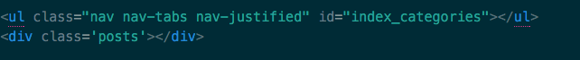
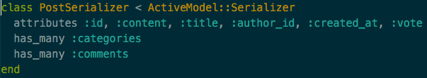
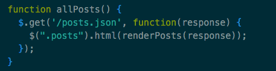

At the end of building my Rails project, I was attempting to add sort and search features, that, while not difficult to implement, raised some questions, like: ‘I’m sending data to my controller, so these should be POST, right?!’, and ‘Why are my params showing up in my URI??’. While I initially discovered these were better rendered with ‘GET’ requests(your params are hidden this way), jQuery and AJAX streamline these features much better than implementing them via vanilla Rails.



The best part of jQuery is how interactive it is, but this is also what can make it difficult (I found myself doing quite a bit of rubber-duck debugging). Once the page loads, ‘$(document).ready()’ will fire inside of your Javascript file, which will load any AJAX or click listeners you’ve put inside. For my project, I needed my index page to load all my posts immediately, so I called ‘allPosts()’ inside my document ready to fire an AJAX call that returns all of my Posts through my controller.

Easy, right?! Well, your controller is returning Ruby from your database, so you need your return in a format that’s friendlier to Javascript, like JSON. In order to get a JSON formatted version of your Ruby, you’ll need ‘rails g serializer post’ , which gives you a serializer class that will format your Ruby instance with all of its attributes into JSON (you must specify all attributes you want JSON’ed in your serializer, see below).



Now, back to our JS file. We’ve triggered doc.ready, our click listeners are listening, and now we need our AJAX! Check it out:



As you can see, this is specifically getting the returned JSON from our ‘/posts’ path and adding the response to our div with a class of ‘post’. There’s additional HTML formatting I’m intentionally leaving out of this post to keep things simplified (see the ‘renderPosts(response)’ above? That’s making it look pretty and wrapping it all inside of another div with some bootstrap).

---

That was a basic overview of how to render an AJAX call in your .erb, but websites are rarely that simple. I also implemented a voting system per post, which is slightly more complicated. I needed to pass the posts’ id to a jQuery click listener after the initial AJAX was rendered (don’t forget, that HTML wasn’t rendered until ‘allPosts()’ was called, so creating a click listener for your votes on doc.ready does nothing, since your HTML doesn’t exist yet).

So, there are several ways to do this, but basically you want to attach listeners right after ‘allPosts()’ is successfully happens.

```
function allPosts() {
 $.get(‘/posts.json’, function(response) {
 $(“.posts”).html(renderPosts(response));
 }).success(function(successful_response){
    $('upvote').click(function(){
      //do web stuff here!
    });
  });
 }
```

I decided to use a different method for this. In the HTML of my ‘upvote’ image, I included ‘onClick=”getVoteId(\\’upvote\\’, this.id)”’, which calls the first method, and in turn calls the second:

```
function getVoteId(clicked_class, clicked_id) {
 if(clicked_class === ‘upvote’) {
  upVote(clicked_id);
 } else {
  downVote(clicked_id);
 }
}

function upVote(postId) {
 $.get(‘/upvote/’ + postId).success(function(response) {
  $(‘b[data-id=”’ + postId + ‘”]’).text(response[“post”][“vote”]);
 });
}
```

Notice the id of the post is being passed to the JS & controller, and the correct selector is updated with the new vote count.

---

What makes jQuery & AJAX fun is that it’s tying everything together — your HTML, CSS, databases, and Rails. You’re focusing on how your website is interacting at the foundation, and while this can get complicated, the challenge of it all is what makes this fun.
